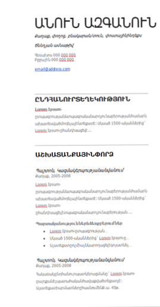

# Html Css 1

## Վեբ ծրագրավորում,
 Վեբ ծրագրավորումը ծրագրավորման մի բաժին է, որն զբաղվում է Համացանցում դինամիկ կայքերի ստեղծման և շահագործման աշխատանքով։ Այսինքն ապահովում է էջի տեսքը, ֆունկցիաները և որևէ իրավիճակից կախված` էջի թարմացումը։ Այս գործընթացը կազմակերպվում է Վեբ էջերի ծրագրավորողների կողմից` կիրառելով ծրագրային կոդեր և տեխնիկական միջոցներ։ Աշխատանքն ինքնին շատ բարդ է, պահանջում է մի քանի ծրագրավորման լեզուների իմացություն, տեխնիկական միջոցների կիրառման հմտություններ և տրամաբանություն։ Ծրագրավորման լեզուները նախատեսված են աշխատելու վեբ տեխնոլոգիաների հետ համատեղ:Այդ իմաստով էլ Վեբ ծրագրավորման լեզուներն առանձնացվում են երկու խմբերով` հաճախորդի սպասարկման և սերվերին միացնող լեզուներ։ Վեբ ծրագրավորման լեզուները այն լեզուներն են, որոնք հիմնականում ստեղծված են վեբ տեխնոլոգիաների աշխատանքը կազմակերպելու և ապահովելու նպատակով։

 ## Հաճախորդների սպասարկման լեզուներ

Անվանումից էլ հասկանալի է, որ այս լեզուն աշխատում է հաճախորդի կամ օգտվողի միջավայրում, որն էլ ապահովում է բրաուզերը։ Սա այն հիմնական մտահոգությունն է, որն առաջանում է ծրագրի կոդը գրելիս. արդյոք հաճախորդի կողմից կիրառվող բրաուզերը կկարողանա ճիշտ արտածել ինֆորմացիան, այսինքն կկարդա տվյալ կոդը։ Այն դեպում, եթե օգտատերը արգելում է ծրագրային հաճախորդի աշխատանքը, ապա այն իրականացնել հնարավոր չէ, ինչքան էլ ցանկանա ծրագրավորողը։ Կարող է պատահել նաև այնպես, որ տարբեր զննարկիչներ կամ միևնույն զննարկիչի տարբեր տեսակներ միևնույն ծրագրային կոդը իրականացնեն տարբեր ձևերով:Մյուս կողմից էլ պետք է հաշվի առնել այն, որ ծրագրավորողը հույսը թողնում է զննարկիչի մեջ աշխատող սերվեր ծրագրերի վրա, այս դեպքում հարցում է արվում նրանց աշխատանքի մեխանիզմի մասին և պարզեցում կատարվում ծրագրային կոդի մեջ, որն էլ ազատում է հետագա աշխատանքների դժվարություններից ի հաշիվ այն ծրագրերի, որոնք իրականացվում են հաճախորդների սպասարկման համար։

## Սերվեր լեզուներ

Եթե օգտվողը հարցում է կատարում որևէ էջի (գնում է այդ էջ հղումով կամ ներմուծում է այդ էջի հասցեն իր զննարկիչի որոնողական դաշտում), ապա այդ էջը նախ ենթարկվում է զննարկիչի հետազոտությանը, այսինքն` աշխատում են այն բոլոր ծրագրերը, որոնք կապված են այդ էջի հետ, հետո միայն ֆայլի տեսքով բացվում է անհրաժեշտ էջը։ Այդ ֆայլը կարող է ունենալ հետևյալ ընդլայնումներից որևէ մեկը` HTML, PHP,node.JS, ASP, ASPX, Perl, SSI, XML, DHTML, XHTML: Ծրագրի աշխատանքն ամբողջովին կախված է զննարկիչից, որի մեջ էլ պետք է աշխատի տվյալ կայքը, նաև այն տարբերակից (версия), որով աշխատում է։ Շատ կարևոր հանգամանք է նաև տվյալների բազայի հետ աշխատելու համար նախատեսված սերվեր լեզուների (Տվյալների բազայի ղեկավարման համակարգ`ՏԲՂՀ) օգտագործումը ծրագրավորման մեջ, որն էլ կարող է ցանկացած պահի պահանջվել։

## HTML ներածությունը

## Ի՞նչ է HTML - ը

HTML (HyperText MarkUp Language)–ը գերտեքստային նշագրման լեզու է։ Նախատեսված է կայքերում տեքստեր, գրաֆիկական էլեմենտներ, աղյուսակներ և այլ էլեմենտներ պատկերելու համար։ Տեքստային փաստաթղթերը, որոնք պարունակում են HTML կոդ (.html կամ .htm ընդլայնում պետք է ունենան), մշակվում են հատուկ ծրագրերի միջոցով, որոնք ցուցադրում են փաստաթուղթը իր ձևավորման համաձայն։ Այդ ծրագրերը, որոնք անվանում են դիտարկիչներ 

## HTML փաստաթղթի հիմնական կառուցվածքը։
```html
<!DOCTYPE html>
<html>
    <head>
        <title>Էջի վերնագիր</title>
        <meta charset="UTF-8">
    </head>
    <body>

            Էջի կոնտենտը

    </body>
</html>
```

## Ի՞նչ է DOCTYPE-ը

   Յուրաքանչյուր HTML փաստաթուղթ, որ համապատասխանում է HTML ստանդարտի որևէ տարբերակի, պետք է սկսվի   !DOCTYPE…ով: DOCTYPE-ը նախատեվսած է տվյալ փաստաթղթի տիպի մասին տեղեկություն տալու համար։ Դա անհրաժեշտ է, որպեսզի բրաուզերը հասկանա, թե ինչպես ինտերպրետացիայի ենթարկի տվյալ էջը, քանի որ HTML-ը ունի մի քանի տարբերակ (վերսիա): Այդ նպատակով DOCTYPE-ը գրում են ֆայլի հենց առաջին տողում։

## Թեգերի տեսակները
Հիմնական թեգերը
•	Տեքստերի հետ աշխատող թեգեր
•	Հղումներ
•	Գրաֆիկական էլեմենտներ
•	Աղյուսակներ


## Ինքնափակվող թեգեր
`<br>` - տողադարձ <br>
`<hr>` - հորիզոնական գիծ  <br>
`` - նկար տեղադրելու թեգ<br>
`<meta>` - մետատվյալների նկարագրման թեգ<br>
`<input>` - տեքստային դաշտերի թեգ<br>
`<link>` - հումների թեգ<br>

## Բացվող և փակվող թեգեր
`<p></p>`<br>
`<div></div>`<br>
`<span></span>`<br>
`<h1></h1>`<br>
`<h6></h6>`<br>
`<a></a>`<br>


## Վերնագրեր (h1-h6 տարրերը)
`
`
        `<h1>Առաջին աստիճան</h1>`<br>
        `<h2>Երկրորդ աստիճան</h2>`<br>
        `<h3>Երրորդ աստիճան</h3>`<br>
        `<h4>Չորրորդ աստիճան</h4>`<br>
        `<h5>Հինգերորդ աստիճան</h5>`<br>
        `<h6>Վեցերորդ աստիճան</h6>`<br>
  

## Հղումներ
`
`
    ` <a href="#">հղում</a> ` <br>
    `<a href="#idname">հղում 1 </a>`<br>
    `<a href="ForEach.am" target="_blank"> հղում 2</a>`<br>

## Համարակալված ցուցակներ
```html
<ol start="5" reversed >
	<li> text </li>
	<li> text </li>
	<li> text </li>
</ol>
```
## Չհամարակալված ցուցակներ
```html
<ul> 
	<li> text </li> 
	<li> text </li>
	<li> text </li>
</ul>
```

## Ատրիբուտներ
Ատրիբուտներ հատուկ բառեր են, որոնք օգտագործվում են՝ տեգին որոշակի արժեքներ փոխանցելու համար :
Օրինակ՝ <br>
<հ1 Ատրիբուտ="արժեք">text</հ1>


## Տնային աշխատանք 
1. Կազմել նկարում պատկերված Ռեզյումեն։



