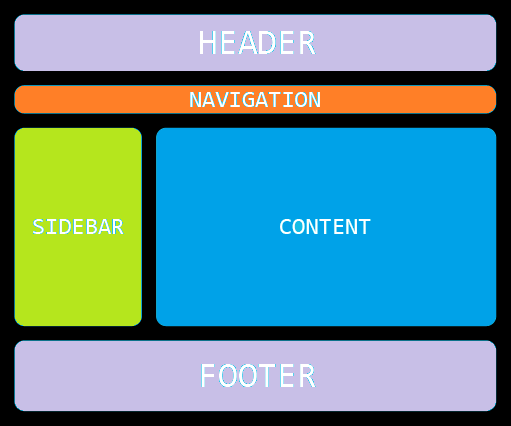
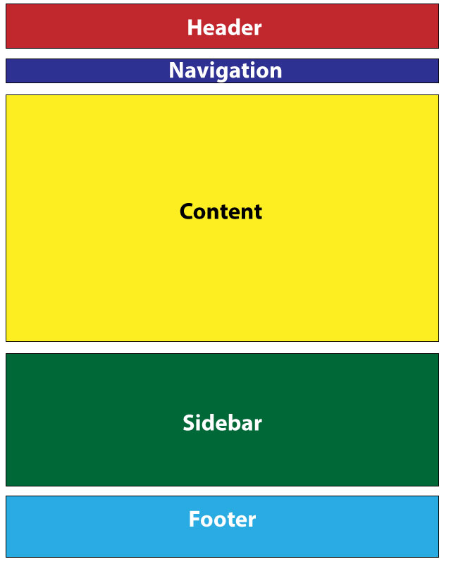

# HTML & CSS 4

## Կայքի հիմնական կառուցվածքը

1. Կայքի ստրուկտուրան HTML5-ի թեգերով
2. Class և Id
3. Div էլեմենտ
4. Նշագրում div էլեմենտներով
5. Div և span էլեմենտներ:


```html
<!DOCTYPE html>
<html lang="en">
    <head>
        <meta charset="UTF-8" />
        <title>Html5 tags</title>
    </head>
    <body>
        <header>
            <nav>...</nav>
        </header>
        <main>
            <section>
                <header>
                    <nav>...</nav>
                </header>
            </section>

            <aside>...</aside>
            <article>...</article>
        </main>
        <footer>...</footer>
    </body>
</html>
```

## Class

Class-ը տարրին վերագրում է դասի անուն:Միևնույն դասին պատկանող բոլոր տարրերինկարելի է վերագրել նույն անունը: Դասերնօգտագործվում են ոճերի կասկադայինաղյուսակներում նույն դասին պատկանողտարրերի խումբը ոճավորելու համար:Ցանկացած էլեմենտ կարող է ունենալ միքանի կլաս, նույն կլասից մի էջում կարողէ ունենալ մի քանի էլեմենտ: Այսատրիբուտում թույլատրվում է նշելմիաժամանակ մի քանի անուններ, որոնքմիմյանցից բաժանվում են բացատով:

## Id և class

Id-ն և class-ը ունիվերսալ հատկանիշներ են, որոնք կարող են օգտագործվել HTML-ի ամենատարբեր թեգերի հետ: Ցանկացած էլեմենտ կարող է ունենալ և՛ id, և՛ class, դրանց անվանումները կարող են սկսել տառերով, "―" և "-" սիմվոլներով ( չի կարող սկսել թվանշանով կամ այլ սիմվոլներով)։ Եթե նույն էլմենտն ունի և՛ id, և՛ class, ապա կարևորությունը տրվում է id-ի հատկություններին:

```html
<!DOCTYPE html>
<html lang="en">
    <head>
        <meta charset="UTF-8" />
        <title>Id & class</title>
    </head>
    <body>
        <div class="box box-1" id="box-1"></div>
        <div class="box" id="box-2"></div>
        <div class="box "></div>
        <p class="box">text</p>
    </body>
</html>
```

## Div vs Span

Span տարրի միջոցով ստեղծվում եններտողային բլոկներ՝ հետագայումոճավորելու համար: Առանց ոճերի կիրառմանայս տարրը ոչ մի իմաստ չունի: Spanը ևDiv-ը համարվում են կոնտեյներայինէլեմենտներ՝ այսինքն կարող են պարունակելբազմաթիվ տողային և բլոկային էլեմենտներ։
2 թեգերի տարբերությունը կայանում է նրանում, որ span-ը տողային էլեմենտ է և զբաղեցնում է իր տարողությամբ երկարություն։ Div-ը բլոկային էլեմենտ է՝զբաղեցնում է տողի ամբողջ երկարությունը։
HTML4 vs HTML5
HTML5-ում ստեղծվել են հատուկ թեգեր, որոնց անվանումներն ավելի են օգնում խմբավորումներ կատարելուն։

## CSS(Cascading Style Sheets)

1. Ի՞նչ է CSS - ը
2. CSS – ի սինտաքսիսը
3. CSS – ի հայտարարման եղանակները
4. Display հատկություն
5. Գույները CSS ֊ ում, Բարձրություն, երկարություն
6. Տեքստի և ցուցակի նշիչի տեսակը
7. Չափման միավորներ
8. Icon տեղադրել և տառատեսակի փոփոխում

## CSS ոճավորելու եղանակները

1. Inline ոճավորում
2. Ոճավորում head բաժնում
3. Ոճավորում առանձին ֆայլում

## Inline ոճավորում

Դրական կողմեր-Կարելի է արագ ստիլավորել էլեմենտները։
Բացասական կողմեր-Պետք է ստիլավորել նույնատիպ թեգերն առանձին-առանձին։ Դժվար է խմբագրել։

```html
<!DOCTYPE html>
<html>
    <head>
        <title>Inline ոճավորում</title>
    </head>
    <body>
        <p style="color: red">text</p>
    </body>
</html>
```

## Ոճավորում head բաժնում

Դրական կողմեր - Կարելի է մեկ ոճային կանոնը գրել մի քանի էլեմենտի համար։
Բացասական կողմեր - Հարկավոր է նույն կոդը գրել մի քանի ֆայլերում։

```html
<!DOCTYPE html>
<html>
    <head>
        <title>Head բաժնում</title>
        <style>
            p {
                color: red;
            }
        </style>
    </head>
    <body>
        <p>text</p>
    </body>
</html>
```

## Ոճավորում առանձին ֆայլում

Դրական կողմեր

1. Կարելի է կցել ոճաթերթը բոլոր էջերին
2. Հեշտ է խմբագրվում
3. Ֆայլը քեշավորվում է

## Ինչպես միացնել css ոճաթերթը html-ին

```html
<!DOCTYPE html>
<html>
    <head>
        <title>Առանձին ֆայլում</title>
        <link rel="stylesheet" type="text/css" href="style.css" />
    </head>
    <body>
        <p>text</p>
    </body>
</html>
```

## Առաջնահերթություն

```css
h1 {
    color: black !important;
}
h1 {
    color: green;
}
```

## Display հատկություն

Display հատկության միջոցով սահմանվում է, թե ինչպես տարրը պետք է ցուցադրվի փաստաթղթում: Display հատկության առավել հաճախ կիրառելի արժեքներից են ․

1. inline -բլոկի մակարդակի տարրը ցուցադրել տողի մակարդակի տարրի տեսքով,
2. block - տողի մակարդակի տարրը ցուցադրել բլոկի մակարդակի տարրի տեսքով,
   3.none-փաստաթղթից ժամանակավորապես տարրը հեռացվում է, նրա տեղը չի պահպանվում:
   Տարրի ցուցադրման փոփոխումը չի հանգեցնում տիպի փոփոխման, այսինքն՝ տող մակարդակի տարրը բլոկի մակարդակի տարրի տեսքով ցուցադրելուց հետո չենք կարող նրա մեջ բլոկի մակարդակի տարր տեղադրել:

## Գույները CSS - ում, Բարձրություն, երկարություն

1. 16-ական համակարգով #ff0000;
2. rgb(255,0,0)
3. red

```css
.box1 {
    background-color: red;
    background-color: red;
    background-color: red;
}
```

## Icon տեղադրել և տառատեսակի փոփոխում

```html
<head>
    <meta charset="UTF-8" />
    <title>menu</title>
    <link rel="shortcut icon"href="favicon.ico" type="imagex-icon">

    <link rel="preconnect" href="https://fonts.googleapis.com" />
    <link rel="preconnect" href="https://fonts.gstatic.com" crossorigin />
    <link
        href="https://fonts.googleapis.com/css2?family=Smooch&display=swap"
        rel="stylesheet"
    />

    .element{
        font-family: 'Smooch', cursive;
    }
</head>
```

## Տնային աշխատանք 
1. Կազմել նկարում պատկերվածը։



