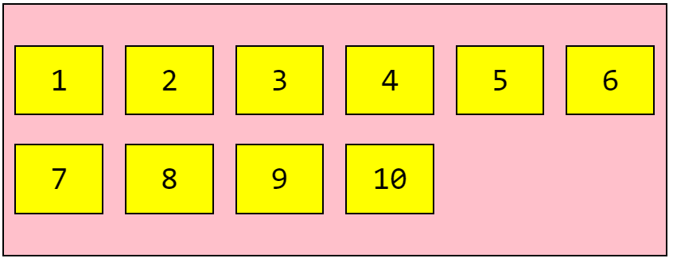

# Html Css 5

## Սելեկտորներ

```css
ul > li {
    ...;
}
div.box {
    ...;
}
div#test {
    ...;
}
div + p {
    ...;
}
p ~ ul {
    ...;
}
input[type="text"] {
    ...;
}
[target] {
    ...;
}
[target="_blank"] {
    ...;
}
```

## Background

```css
background-color: red;
background-image: url("path");
background-position: right top;
background-attachment: fixed;
background-repeat: no-repeat | repeat-x | repeat-y;
background: #ffffff url("img_tree.png");no-repeat right top;
background-size: contain; (initial | cover | ...);
background-blend-mode: normal; (multiply | hard-light |difference| ...);
background-origin: content-box; (border-box | padding-box | initial | inherit);
```

## Բլոկի լայնությունը և բարձրությունը

Բլոկի լայնությունը և բարձրությունը

width-պարունակության տարածքի երկարություն, կարելի է կիրառել բլոկային և փոխարինվող տարրերի վրա, արժեքը կարող է տրվել բացարձակ և հարաբերական միավորներով: Inherit արժեքի միջոցով տարրը կժառանգի ծնող տարրի արժեքը: Եթե տարրի լայնությունը բացահայտ տրված չէ, ապա լռելյայն ստանում է auto արժեքը:

height-պարունակության տարածքի բարձրությունը, բացասական արժեքներ չի ընդունում: Կիրառվում է բլոկային և փոխարինվող տարրերի վրա: Լռելյայն ընդունում է auto արժեքը:

## Նվազագույն և առավելագույն լայնություն

min-width- նվազագույն լայնություն
max-width-առավելագույնը լայնություն
Max-width հատկությունը կարող է ստանալ none արժեքը, որի դեպքում բլոկի լայնության վրա սահմանափակում չի դրվում: Բացասական արժեքներ չեն թույլատրվում:
Տարրի լայնությունը չի կարող փոքր լինել min- width–ի արժեքից.


## Margin, Արժեքների միավորում
```css
div{
margin: 10px 20px 30px 40px; (top | right | bottom | left);
}
div{
margin: 10px 20px 30px; (top | right-left | bottom);
}
div{
margin: 10px 20px; (top-bottom | right-left);
}
div {
margin: 10px; (top-right-bottom-left);
}
div{
margin: 0 auto;
}
```

## Padding, Արժեքների միավորում
```css
div{
    padding-top: 10px;
    padding-right: 20px;
    padding-bottom: 30px;
    padding-left: 40px
}
```

## Border, Արժեքների միավորում

```css
p{
    border-style:solid (dotted | dashed | double| ...);
    border-width: 5px (medium | thick);
    border-color: green; (blue | red | ...);
}

p {
  border-top-style: dotted;
  border-right-style: solid;
  border-bottom-style: dotted;
  border-left-style: solid;
}
p{
    border-style:solid dotted dashed double;
    border-width: 2px 10px 4px 20px;
    border-color: red green blue yellow;
}
```

## Float հատկություն

```html
<div style="float:left">
    Some text
</div>
<div style="float:right">
    Some text
</div>
<div style="float:none">
    Some text
</div>
```

## Տնային աշխատանք 
1. Ստանալ նկարում պատկերվածը։


