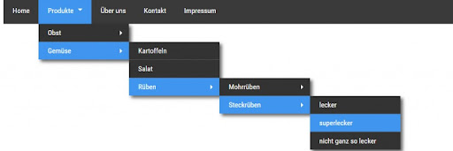

# Html Css 7

## Pseudo-elements

Pseudo-elements (::after, ::before, ::selection, ::first-letter, ::first-line)
Pseudo-element -ը թույլ է տալիս ոճավորել ընտրված էլեմենտի որոշակի մաս: Դրանց pseudo-class-ներից տարբերակելու համար դրվում է կրկնակի վերջակետի նշանը «։։»: Վերջիններս աշխատում են միայն բլոկային էլեմենտների հետ: Եթե դիմացի հատվածում սելեկտորի անվանումը չնշենք, ապա այդ հատկությունը կվերաբերվի բոլոր էլեմենտներին:

1. Այս մեթոդով դիմում ենք բոլոր էլեմենտներին

```css
::first-line {
    color: blue;
}
```

2. Յուրաքանչյուր `<p> </p>` էլեմենտի առաջին տողը:

```css
p::first-line {
    color: blue;
}
```

3. Յուրաքանչյուր `<p> </p>` էլեմենտի առաջին տառը(սիմվոլը):

```css
p::first-letter {
    color: blue;
}
```

4. Ոճավորում է մկնիկով նշված կոնտենտի մասը:

```css
::selection {
  color: green;
```

5. Հղումից առաջ ավելացնում է նշանը:

```css
a::before {
    content: "♥";
}
```

6. Հղումից հետո ավելացնում է սլաքը:

```css
a::after {
    content: "→";
}
```

## Pseudo-Classes

Pseudo-class-ը բանալի բառ է, որն ավելանում է սելեկտորին, և նախատեսված է որոշելու էլեմենտի հատուկ վիճակը: Դրանք ևս աշխատում են միայն բլոկային էլեմենտների հետ։ Pseudo-class֊ների դեպքում օգտագործվում է «։» նշանը։

Pseudo-Classes (։link, ։active, ։hover, ։visited)

1. Նախնական կարգավիճակ (չբացված հղում):

```css
a:link {
    color: #ff0000;
}
```

2. Արդեն բացված հղում:

```css
a:visited {
    color: #00ff00;
}
```

3. Մկնիկով հղմանը նշելու կարգավիճակ:

```css
a:hover {
    color: #ff00ff;
}
```

4. Մկնիկով հղման վրա սեղմելու կարգավիճակ:

```css
a:active {
    color: #0000ff;
}
```

## Pseudo-Classes (:hover)

```css
.submenu {
    width: 200px;
    height: 200px;
    background-color: orange;
    display: none;
}
.submenu:hover {
    background-color: red;
}
```

## Pseudo-Classes (:checked)

```html

<body>
  <label for="check">Click me</label>
   <input type="checkbox" id="check">
   <div class="submenu"></div>
</body>

/* Css */
input:checked ~ .submenu {
    display: block;
}
.submenu {
    width: 200px;
    height: 200px;
    background-color: orange;
    display: none;
}
```
## Տնային աշխատանք 2
1. Նկարում պատկերված օրինակով ստանալ մենյու:




