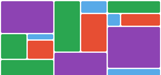

# Html Css 8

## Flex մոդուլ

Flex-ը նախատեսված է էլեմենտների արդյունավետ դասակարգման համար : Ճկունության գլխավոր միտքը կայանում նրանում, որպեսզի կոնտեյներին տրվի հնարավորություն փոխելու էլեմենտների հերթականությունը, բարձրությունն ու երկարությունը և առավել արդյունավետ լրացնի հասանելի ազատ տիրույթը: Թույլ է տալիս կոնտեյներին ընտրել տողերից և սյուներից միայն մի ուղղություն, որի պատճառով էլ խորհուրդ չի տրվում օգտագործել ավելի մեծ նախագծերում:

## Կոնտեյների համար հատկություններ

1. Display
2. Flex-direction
3. Flex-wrap
4. Flex-flow
5. Justify-content
6. Align-items
7. Align-content

## Display

## 1. display: flex:

կիրառելով էլեմենտին տալիս ենք flex հատկություն, այն կլինի տողային թե բլոկային կախված է հատկության արժեքից:

```css
.box {
    display: flex;
}
```

## 2. Flex-direction

Այս հատկությունով որոշվում է, էլեմենտների դասակարգման ուղղությունը կոնտեյների տիրույթում: Կոնտեյներները ընդունում են միայն մի ուղղություն` հորիզոնական կամ ուղղահայաց: Ընդունում է հետևյալ արժեքները`

row (լռելյայն) - դասակարգում ձախից աջ,

row-reverse - դասակարգում աջից դեպի ձախ,

column - դասակարգում վերևից դեպի ներքև,

column-reverse - դասակարգում ներքևից դեպի վերև:

## Flex-direction․ Օրինակ

```css
.box {
    flex-direction: row | row-reverse | column | column-reverse;
}
```

## 3. Flex-wrap

Լռելյայն էլեմենտները կտեղավորվեն մի տողում: Բայց կարելի է փոխել այդ հատկությունը և wrap արժեքի միջոցով թույլատրել էլեմենտներին իջնեն ներքևի տող: Ընդունում է հետևյալ արժեքները`
nowrap - բոլոր flex-էլեմենտները կտեղավորվեն մի տողում,

wrap - էլեմենտները կարող են տեղավորվել մի քանի տողերում, վերևից դեպի ներքև:

wrap-reverse - էլեմենտները կարող են տեղավորվել մի քանի տողերում, ներքևից դեպի վերև:

Flex-wrap․ Օրինակ

```css
.box {
    flex-wrap: wrap;
}
```

## 4. Flex-flow

```css
.box{
  flex-flow||flex-direction||flex-wrap;
}
```

## 5. Justify-content

Այս հատկությունը թույլ է տալիս լրացնել այն ազատ տիրույթը, որը առաջացել է դասակարգված և չդասակարգված էլեմենների առավելագույն չափերը ստանալուց հետո (լրացնում է ըստ սյուների): Էլեմենտների ցանցը շարժվում է ըստ կոնտեյների։ Արժեքները՝

```
flex-start (default)

flex-end

center

stretch

space-between

space-around space-evenly
```

```css
.box {
    justify-content: flex-start | flex-end | center | space-between |
        space-around;
}
```

## 6. Align-items

Այս հատկությունը թույլ է տալիս լրացնել էլեմենտների սահմանում գտնվող այն ազատ տիրույթները, որոնք առաջացել են դասակարգված և չդասակարգված էլեմենների առավելագույն չափերը ստանալուց հետո(լրացնում է ըստ տողերի): Ընդունում է հետևյալ արժեքները՝

```
flex-start (default)
flex-end
center
stretch
baseline
```

```css
.box {
    align-items: flex-start | flex-end | center | baseline | stretch;
}
```

}

## 7. Align-content

Այս հատկությունը թույլ է տալիս լրացնել կոնտեյների այն ազատ տիրույթները, որոնք առաջացել են դասակարգված և չդասակարգված էլեմենների առավելագույն չափերը ստանալուց հետո(լրացնում է ըստ տողերի): Ընդունում է հետևյալ արժեքները՝

```
flex-start (լռելյայն)
flex-end
center
stretch
space-between
space-around space-evenly
```

```css
.box {
    align-content: flex-start | flex-end | center | space-between | space-around
        | stretch;
}
```


## 8. Align-self
Այս հատկությունը թույլ է տալիս որոշել էլեմենտի դիրքը իր անձնական տիրույթի սահմաններում:Արժեքները՝
```
flex-start (լռելյայն)
flex-end
center
stretch
baseline
```

```css
.box {
  align-self: auto | flex-start | flex-end | center | baseline | stretch;
}
```

### Կոնտեյների համար հատկություններ

Ուշադրություն դարձրեք այն բանին, որ float, clear և vertical-align հատկությունները flex տիրույթում չեն գործում:Այն կախված է նրանից, որ "margin: auto" արժեքի դեպքում ստանում է  հավելյալ տարածք, և էլմենտը տեղափոխվում է կենտրոն բոլոր կողմերից` վերև-ներքև, աջ-ձախ:


## Տնային աշխատանք 2
1. Ստանալ նկարում պատկերվածը։





