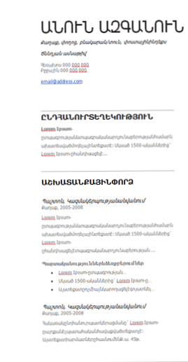

# Sass - 1

## SASS

SASS–տեխնոլոգիա է, որը թույլ է տալիս կոմպիլացնել CSS կոդը։ Այսինքն, ինչպես ծրագրավորման լեզուներում,կարելի է ստեղծել փոփոխականներ, այնպես էլ SASS ում կարող ենք հայտարարել փոփոխականներ և դրանքօգտագործել CSS կոդում։ Այն օգնում է, երբ մի արժեքը css կոդում պիտի օգտագործենք մի քանի տեղ։ Այսպիսով,փոփոխելով փոփոխականի արժեքը, css կոդը կոմպիլացնում ենք և հին արժեքի փոխարեն ամբողջ css ֆայլումօգտագործում նոր արժեքը։

### SASS - ի առավելությունները

Ամբողջական համատեղելիություն CSS-ի հետ
SASS-ը համատեղելի է CSS-ի բոլոր տարբերակների հետ: Այդ իսկ պատճառով այն կարող ենք հեշտությամբ օգտագործել CSS-ի կամայական գրադարանի հետ:
Հարուստ ֆունկցիոնալ
SASS-ը ունի ավելի շատ հնարավորություններ քան CSS-ի կամայական այլ ընդլայնում :

### Framework-եր

Կան բազմաթիվ Framework-ներ, որոնք կառուցված են SASS տեխնոլոգիայի հիման վրա: Օրինակ Compass, Bourbon , Susy և այլն:

### SASS to CSS

Գոյություն ունի մի քանի մեթոդ SASS- ով աշխատելու համար ՝ browser-ի , Command Line(terminal)-ի միջոցով ինչպես նաև առանձին ծրագրերի միջոցով,ինչպիսիք են՝CodeKit(mac),Compass.app(mac,windows,Linux),GhostLab(Mac,Windows),Hammer(mac),Koala(mac,windows,linux),Prepros(mac,windows):
Linux and Sass
Linux օպերացիոն համակարգի օգտատերերը Command Line-ում պետք է գրեն հաջորդիվ գրված հրամանները, կարելի է նույնը կատարել նաև NODE.JS-ի կամ RUBY-ի տերմինալներում։

### SASS and Command Line

SASS-ից օգտվելու համար Command Line-ի օգնությամբ անհրաժեշտ է գրել հետևյալ հրամանը:

```bash
sass source/stylesheets/index.scss
build/stylesheets/index.css

```

Նախքան աշխատանքը սկսելը նախ ստուգեք SASS-ի տեսակը հետևյալ հրամանով ․
Եթե ամեն ինչ բարեհաջող է անցել, ապա դուք կստանաք հաղորդագրություն SASS-ի տարբերակի մասին: Դրանից հետո կարող եք օգտվել help հրամանից՝ SASS հրամանների հետ ավելի մանրամասն ծանոթանալու համար:

```
sass --version
Sass --help
SASS and Application
```

Դուք կարող եք տեղադրել SASS-ը Windows, Mac, կամ Linux-ում ներբեռնելով դիստրիբուտիվը ձեր օպերացիոն համակարգի համար GitLab-ից և կատարելով համապատասխան հրամանները՝ View Commands:

### SASS and Application

Կան բազմաթիվ ծրագրեր Windows, Mac, կամ Linux օպերացիոն համակարգերի համար, բայց դասընթացի ընթաքում կօգտագործենք Koala։

### Ինչպես օգտվել Koala-ից

Նախագծի մեջ ստեղծեք ֆայլ .scss ընդլայնումով (scss-ը sass-ի մոդիֆիկացված տարբերակն է, գրելաձև նմանեցված է css-ի գրելաձևին)։ Բացում ենք Koala-ն, սեղմում "+" նշանի վրա և ներբեռնում ձեր նախագիծը: Նշում ենք, թե որ ֆայլում պետք է կոմպիլացվի scss կոդը: Այնուհետև սեղմում ենք compile և սկսում գրել scss կոդը։
Ինչ է փոփոխականը
Փոփոխականը անվանում ունեցող հիշողության մի հատված է, որը կարելի է օգտագործել տվյալների հետ աշխատանքի համար, ու որը կարող է փոխել իր արժեքը ծրագրի իրականացման ընթացքում։ Փոփոխականները սկսում են $-ի նշանով և տրվում են որպես CSS հատկություն։

### Լոկալ և գլոբալ փոփոխականներ

Փոփոխականները լինում են լոկալ և գլոբալ։ Լոկալ փոփոխականները հասանելի են միայն սելեկտորի հայտարարման տիրույթում։ Եթե փոփոխականը հայտարարված է սելեկտորներից դուրս, այն համարվում է գլոբալ։ Եթե ցանկանում եք, որ լոկալ փոփոխականը հասանելի լինի նաև սելեկտորից դուրս, կարող եք ավելացնել !global նշանը։

### Փոփոխականները Sass-ում

```scss
//1
$color: red;

.rule-1
background-color: $color

```

## Տվյալի տիպ

SassScript-ը ունի 7 հիմնական տվյալի տիպ՝

1. թվեր (1,2,3,4..)
2. տեքստային տիպ (string), որոնք կարող են գրվել թե՛ չակերտների մեջ, թե՛ առանց դրանց (“foo”,hello)
3. գույներ (blue, #fff, rgba(255,0,0,0.5))
4. տրամաբանական տիպ (boolean) (true, false)
5. null (դատարկ, գոյութուն չունեցող)
6. արժեքների ցուցակ, որոնք առանձնանում են իրարից
7. ստորակետերով կամ բացատներով (1.5em 1em 0 2em; Times New Roman, Arial, sans-serif)
8. զանգվածներ (key1: value, key2: value2)

### Mixin – ներ

Mixin-ները կամ խառնուրդները թույլ են տալիս որոշել և օգտագործել այն ոճերը, որոնք ծրագրում օգտագործվում են մի քանի անգամ։ Սա օգնում է խուսափել կոդի կրկնությունից:
Ինչպես ստեղծել Mixin – ներ
Mixin հայտարարում ենք @mixin բանալիային բառով: Այնուհետև գրվում է mixin - ի անունը , իսկ փակագծերում գրվում է @mixin - ի պարունակությունը

```scss
@mixin border-radius($w, $h, $fs, $color, $border) {
    width: $w;
    height: $h;
    font-size: $fs;
    color: $color;
    border-radius: $border;
}

.box {
    @include reset-list(10px, 10px, null, red, 50%);
}
```

## Տնային աշխատանք

1. Ստեղծել .scss ընդլայնումով ֆայլ։Այդ ֆայլում հայտարարել փոփոխականներ(mainColor,brandColor,mainSize,mainFont) և օգտագործել դրանք ստանալու համար նկարում պատկերված ռեզյումեի դիզայնը։



